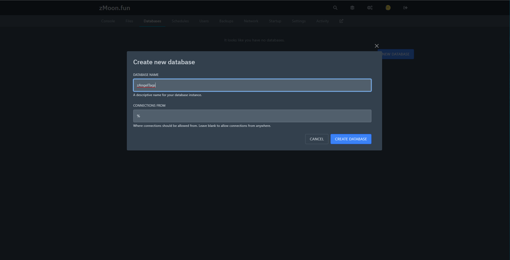

# 🐧 Pterodactyl

First go to your Pterodactyl Panel to your database server section

Then click new database and put the name that you want and connection from your server ip or from % if you want everyone

Then click on create database and go to your panel and you would have the following data

.png>)

The first param is the database name, the second is the ip, the third is the database username.

From here paste the database name

Then click in the eye and you would have the rest of the data

.png>)

Fill the configs params with the pterodactyl info and remember the endpoint the part what is before the : is the ip and after is the port

.png>)

